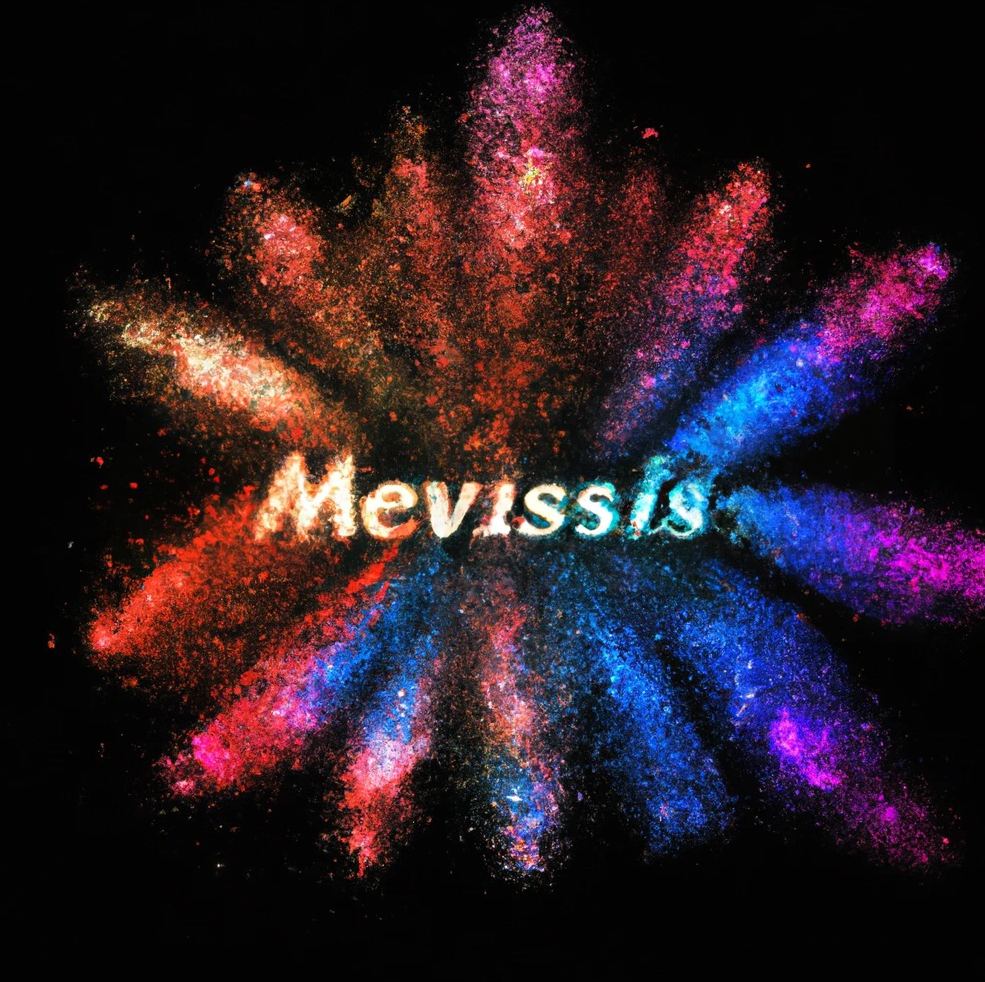

# Hi Mevissis!

#### 📝This is a crazy imagination all about the Reality and so-called X-verse.

#### 🎯The Objectives ---- A System connecting the reality and digital world (Web3)

- [ ] [Elastic Smart Contracts Space]()

- [ ] [Smart Contract Machine]()
- [ ] [Demand Translator Machine]()
- [ ] [Uncountable value Mapper]()

#### Hierarchy of organization

| Mevissis                                                     | Guidance to our organization                    |
| ------------------------------------------------------------ | ----------------------------------------------- |
| **[Mevissi Core](https://github.com/Mevissis/Mevissis-Core)** | **Basic Implementations of Mevissis Sys**       |
| **[Mevissis MIPs](https://github.com/Mevissis/Mevissis-MIPs)** | **Mevissis Improvement Proposals**              |
| **[Mevissis Smart Contract Machine](https://github.com/Mevissis/Mevissis-Smart-Contract-Machine)** | **implementation of Smart Contract Machine**    |
| **[Mevissis Demand Translator Machine(DTM)](https://github.com/Mevissis/Mevissis-DTM)** | **implementation of Demand Translator Machine** |
| **[Mevissis Uncountable value Mapper(UVM)](https://github.com/Mevissis/Mevissis-UVM)** | **implementation of Uncountable value Mapper**  |

##### More details and design see our [gitbook](https://mevissis.gitbook.io/mevissis-whitepaper/~/changes/Q2Yvdaz8pTYdixno3OOP/)📖

